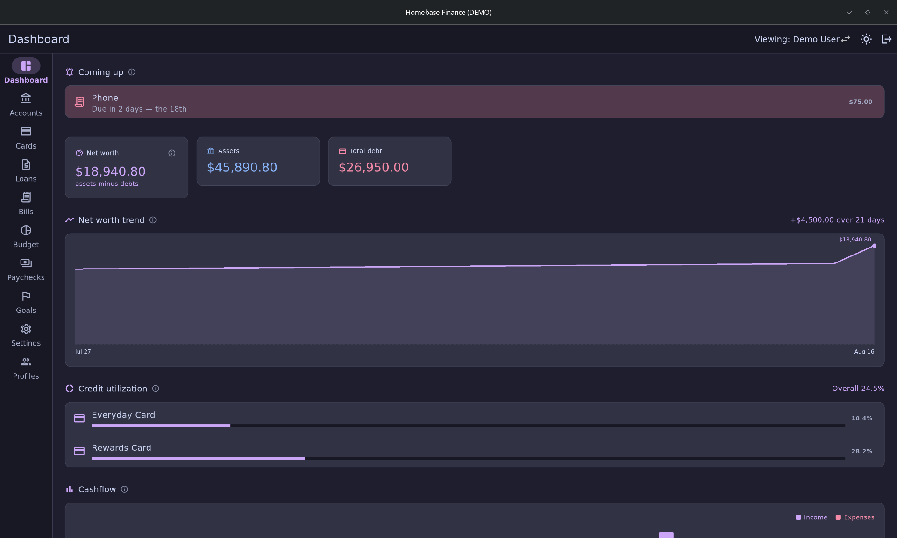
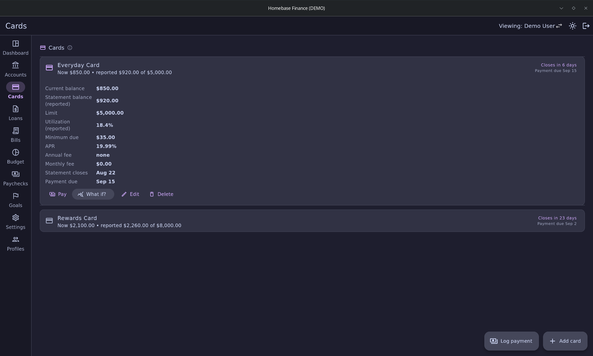
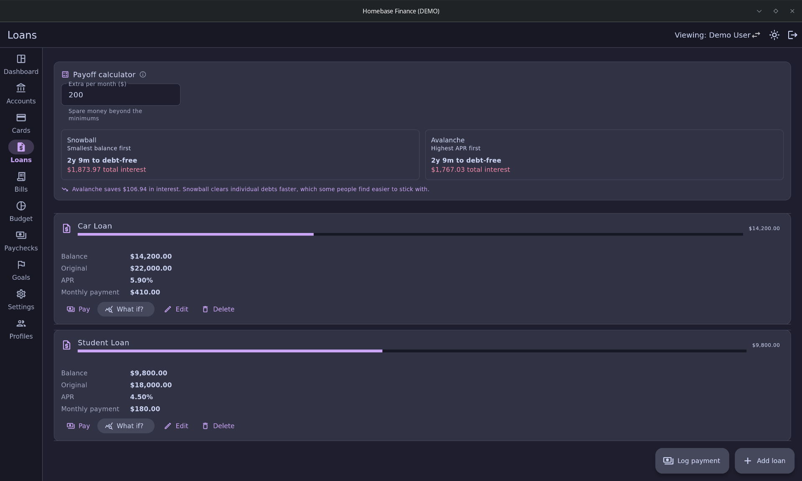
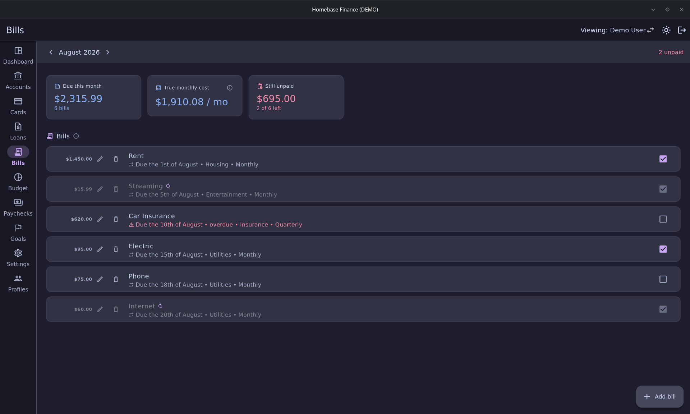
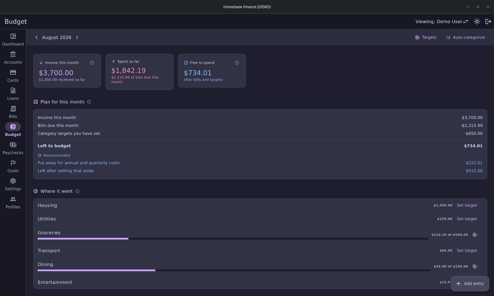
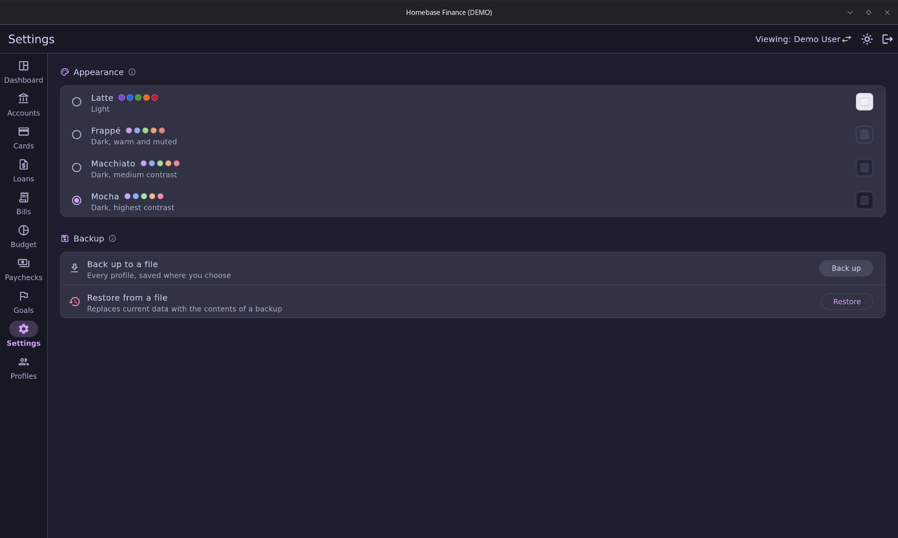

# Homebase Finance

A personal finance tracker for a household, built for the desktop. Everything
stays on your own machine: there is no account to make, no server, and
nothing is uploaded anywhere.

Built with Flutter and Drift (SQLite). Linux desktop is the primary target;
Android is planned as a secondary one.

*All screenshots use generated demo data, not real finances.*

## What it does

**Accounts.** Checking, savings, cash, investment and retirement balances,
grouped by type with a total for each. These are the asset side of net worth.

**Cards.** Balances, limits and utilization, plus statement cycles.
Utilization is calculated from the *statement* balance (what the issuer
actually reports to the credit bureaus), while everything else uses the
current balance, since that is the money you really owe. Both are shown side
by side so the difference is visible rather than silently baked into a
calculation.

**Loans.** Payoff progress, a snowball vs. avalanche comparison, and a
"what if" simulator with a slider for extra monthly payments that shows the
interest and time you would save.

**Bills.** Monthly, quarterly, annual or one-time, with autopay support. Paid
status is recorded against the month it covers, so it resets itself on the
1st and past months keep their real history.

**Budget.** What came in, what went out and what is left for the month.
Paychecks and paid bills post themselves automatically, so most months need
no manual entry beyond cash spending.

**Paychecks.** Set a schedule once (weekly, bi-weekly, semi-monthly,
monthly) and paychecks generate 90 days ahead, mark themselves received on
payday, and can be split across allocations like rent or savings.

**Goals.** Savings or payoff targets with progress tracking, and a monthly
figure to hit a target date.

**Dashboard.** Net worth trend, credit utilization, cashflow, upcoming
bills and a credit score history you log yourself.

## Privacy between profiles

A household has multiple profiles. One is an admin, who can view and switch
into any profile. Everyone else sees only their own data and gets no
indication that other profiles exist.

This is enforced structurally, not by hiding UI: every query in the data
layer takes a required `profileId`, and there is no method that returns rows
across profiles. Backups follow the same rule: an admin's backup covers the
household, anyone else's covers only themselves, and restoring a household
backup as a non-admin touches only their own rows.

Profiles can have a PIN of any length using any characters. A PIN is a gate
for convenience, not encryption: the database itself is not encrypted, so
anyone with access to the file can read it.

## Your data

The database lives at:

    ~/.local/share/dev.homebase.homebase_finance/homebase.sqlite

Settings has a backup action that writes a JSON file wherever you choose, and
a restore that replaces the current data. Restore inspects the file and
shows what it contains before doing anything, refuses files from a newer
version before deleting a single row, and copies the live database next to
itself first so a mistaken restore can still be undone by hand.

Backups are plain JSON and are **not encrypted**, which is fine on a local
drive but worth thinking about before putting one in a synced cloud folder.

## Theme

All four [Catppuccin](https://catppuccin.com) flavors (Latte, Frappé,
Macchiato and Mocha) are selectable in Settings, with Mocha as the default.
Colours come from the official `catppuccin_flutter` package rather than
being copied into this repository.

## Building

See [BUILD.md](BUILD.md).

## Architecture

    lib/
      data/         Drift schema, repository, backup, notifications
      screens/      One file per screen
      widgets/      Shared UI pieces
      theme/        Catppuccin flavors and ThemeData
      util/         Money formatting, payoff maths, PIN hashing

All database access goes through `HomebaseRepository`; widgets never touch
Drift directly. That keeps the per-profile rule in one place and leaves room
for a sync layer later without rewriting the screens.

Schema changes are versioned migrations (currently v11) with tests that
upgrade a real database of each older shape, so existing data survives an
update.

Money is stored as integer cents throughout, never floating point.

## Tests

    flutter test

Around 180 tests across 24 files, covering the payoff and date maths, the
per-profile visibility rule, every schema migration, backup round-trips, and
the automatic behaviour (paychecks receiving themselves, bills recording
autopay, net worth snapshots).

## AI disclosure

This project was built with AI assistance, directed by me.

## License

Unlicense. See [LICENSE](./LICENSE).
